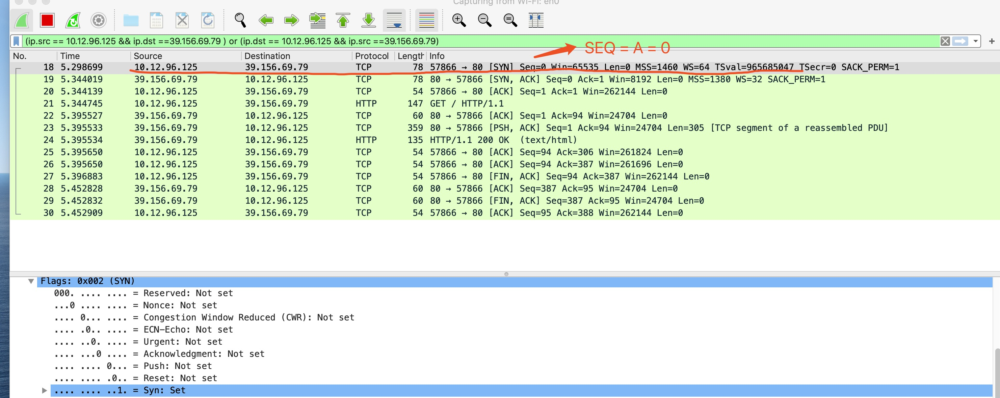
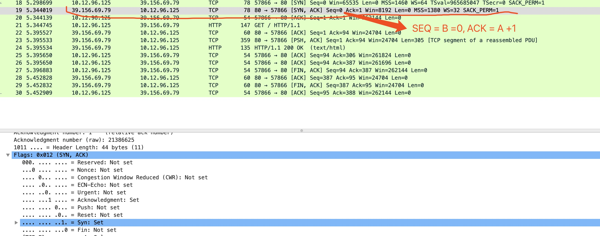
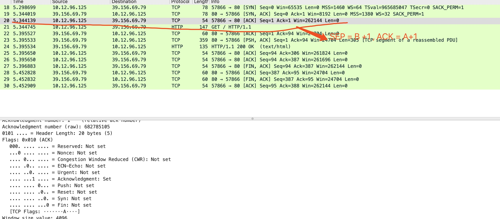
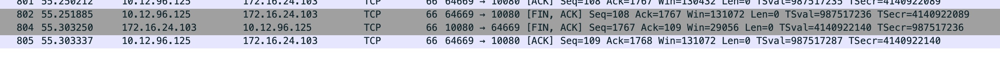
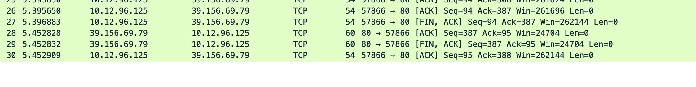

# 基础

## Wiki
-   https://en.wikipedia.org/wiki/Transmission_Control_Protocol


## Wireshark抓包

### TCP/IP 建立链接


**三次握手的过程**

- SYN: The active open is performed by the client sending a SYN to the server. The client sets the segment's sequence number to a random value A.
- In response, the server replies with a SYN-ACK. The acknowledgment number is set to one more than the received sequence number i.e. A+1, and the sequence number that the server chooses for the packet is another random number, B.
- Finally, the client sends an ACK back to the server. The sequence number is set to the received acknowledgement value i.e. A+1, and the acknowledgement number is set to one more than the received sequence number i.e. B+1.

***抓包截图***

1 Client -> Server [SYN]



2 Server -> Client [SYN-ACK]




3 Client -> Server [ACK]




### TCP/IP 断开连接

The connection termination phase uses a four-way handshake, with each side of the connection terminating independently. When an endpoint wishes to stop its half of the connection, it transmits a FIN packet, which the other end acknowledges with an ACK. Therefore, a typical tear-down requires a pair of FIN and ACK segments from each TCP endpoint. After the side that sent the first FIN has responded with the final ACK, it waits for a timeout before finally closing the connection, during which time the local port is unavailable for new connections; this prevents confusion due to delayed packets being delivered during subsequent connections.

A connection can be "half-open", in which case one side has terminated its end, but the other has not. The side that has terminated can no longer send any data into the connection, but the other side can. The terminating side should continue reading the data until the other side terminates as well.

It is also possible to terminate the connection by a 3-way handshake, when host A sends a FIN and host B replies with a FIN & ACK (merely combines 2 steps into one) and host A replies with an ACK.[17]

Some host TCP stacks may implement a half-duplex close sequence, as Linux or HP-UX do. If such a host actively closes a connection but still has not read all the incoming data the stack already received from the link, this host sends a RST (losing the received data) instead of a FIN (Section 4.2.2.13 in RFC 1122). This allows a TCP application to be sure the remote application has read all the data the former sent—waiting the FIN from the remote side, when it actively closes the connection. But the remote TCP stack cannot distinguish between a Connection Aborting RST and Data Loss RST. Both cause the remote stack to lose all the data received.

```$xslt


```


#### 3-way handshake



#### half-duplex four-way handshake




